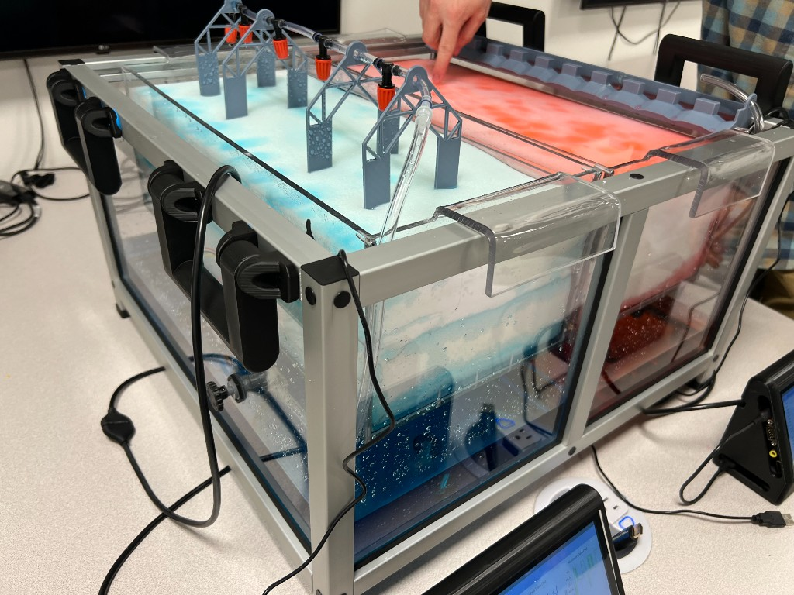
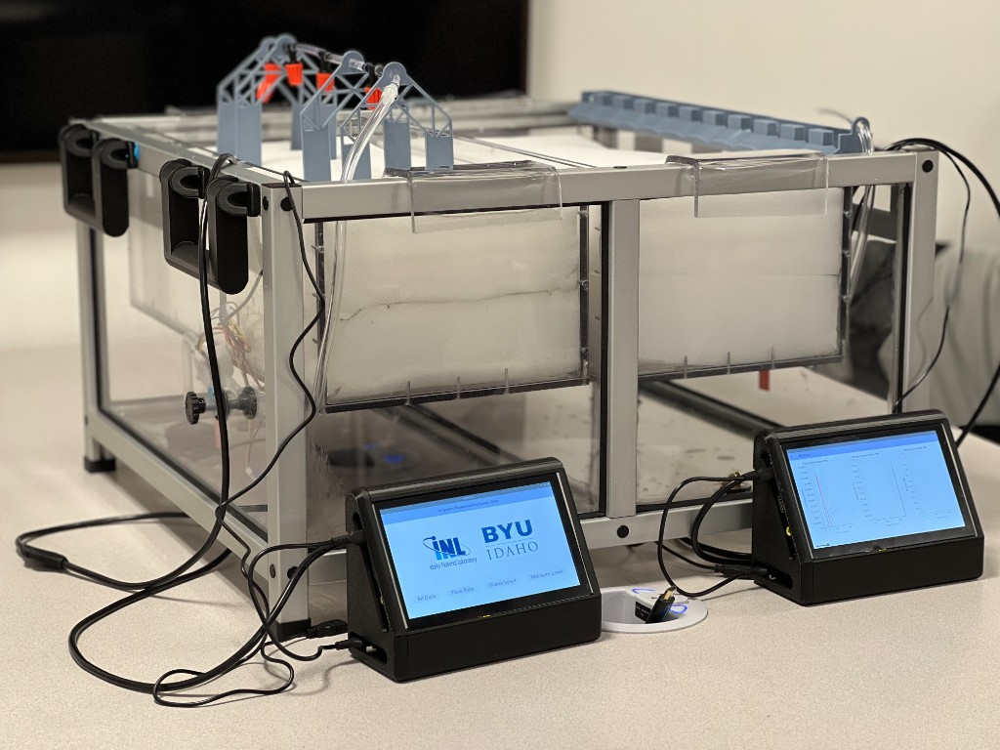
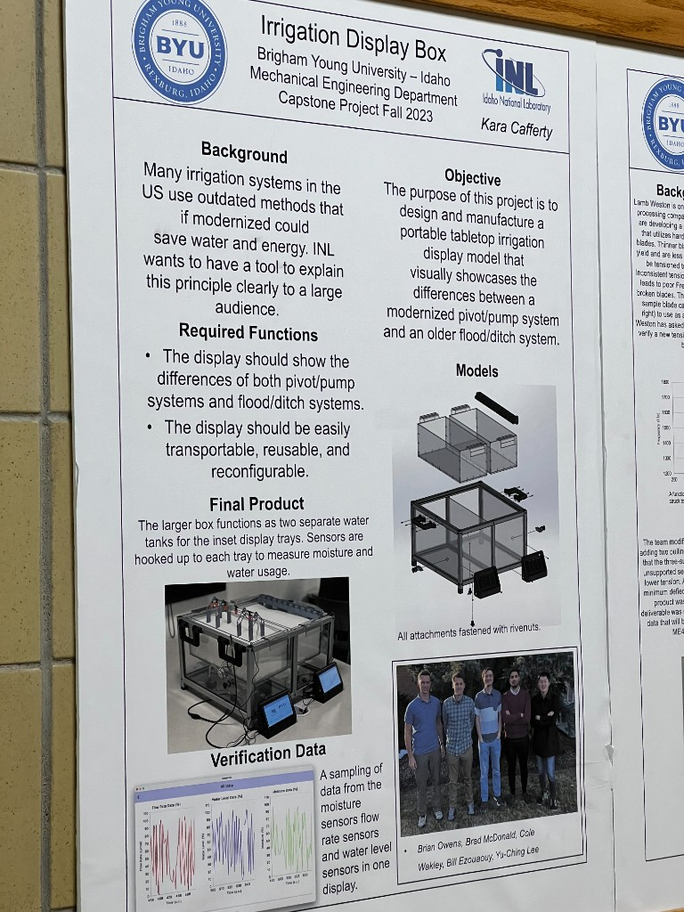

# Irrigation Sensor Visualization

This repository contains the software for the Irrigation Modernization Display, a Brigham Young University–Idaho Mechanical Engineering capstone project completed for Idaho National Laboratory (INL).

The exhibit is a portable tabletop model that compares modernized sprinkler (pivot/pump) irrigation with a traditional flood/ditch system. This codebase implements a custom Linux application, built with Flutter, that runs on a Raspberry Pi with a touch screen. The application reads live flow-rate, water-level, and moisture measurements and presents them as current values and historical graphs.

The [final project presentation](https://youtu.be/TvEDPJKfPd0) is available on YouTube.

## Display

## Software

The Flutter application (`lib/`) is the operator-facing interface. It ingests serial data from an Arduino, buffers samples, and renders time-series charts for flow rate, water level, and moisture. On Linux it uses the hardware serial port; on other platforms it falls back to simulated data for development.

The Arduino firmware (`ArduinoCode/`) samples the soil-moisture, water-level, and flow sensors and streams labeled readings to the Raspberry Pi.
